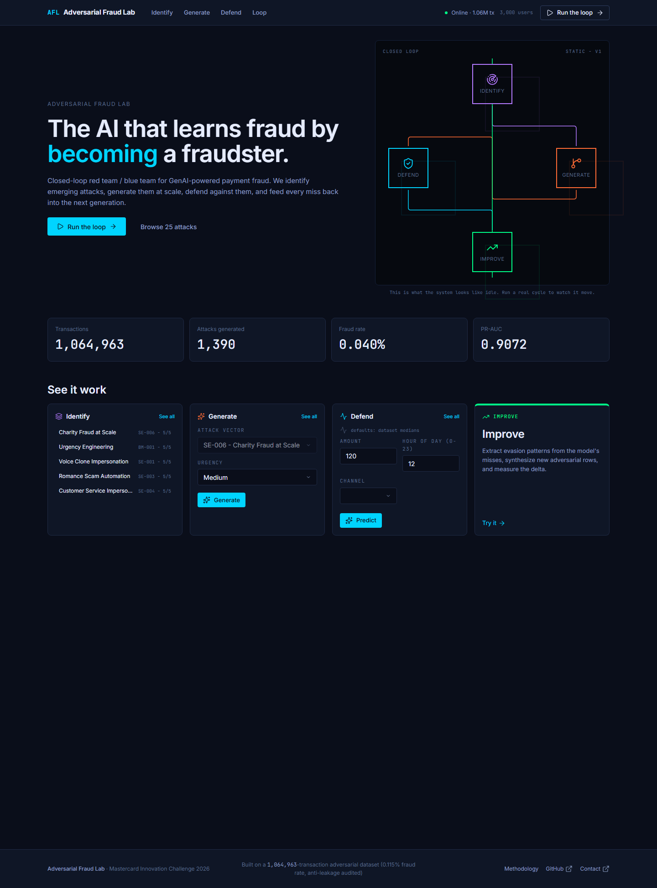

# Adversarial Fraud Lab (AFL)

**Closed-loop Red Team / Blue Team system for GenAI-powered payment fraud detection**



The screenshot above is the live frontend (Vite + React 19 + the trained XGBoost Tier 1 model) talking to the FastAPI backend over real HTTP. Every number on the page - 1,064,963 transactions, 1,390 generated attacks, 0.040% fraud rate, 0.9072 PR-AUC - is served by `/api/system/status` against the real model artifact, not a fixture.

## What It Does

- **Identify** - 25-attack GenAI fraud taxonomy across 5 categories (SE / KYC / PR / AI / BM)
- **Generate** - High-fidelity attack simulation grounded in real fraud-type rows from the test set
- **Defend** - Tiered XGBoost Tier 1 + Isolation Forest Tier 2 ensemble
- **Adapt** - Closed-loop feedback that strengthens from misses

## Quick Start

Two processes - backend (FastAPI, port 8000) and frontend (Vite, port 5173). Both must be running for the live system.

### One-Command Launcher (Windows)

```bash
# From the repo root, with the project\'s venv active (uvicorn + fastapi installed).
.venv\\Scripts\\python.exe -m uvicorn src.api.main:app --port 8000 --host 127.0.0.1
```

The backend boots in ~4s. It loads the trained XGBoost Tier 1 model from `models_artifacts/xgboost_tier1.json`, the Isolation Forest Tier 2 from `models_artifacts/isolation_forest_tier2.joblib`, and the pre-engineered test matrix from `data/processed/X_test.pkl` (213,035 rows, 339 real fraud cases).

Verify health:
```bash
curl http://127.0.0.1:8000/api/health
# {"status":"ok","model_loaded":true,"data_loaded":true,"n_users":213035}
```

### 2. Frontend

The frontend\'s `.env` file (gitignored) is already set to `VITE_DEMO_MODE=false` and `VITE_API_BASE_URL=http://localhost:8000`. The Vite dev server proxies `/api/*` to the backend on port 8000.

```bash
cd frontend
npm install        # first time only
npm run dev        # serves on http://127.0.0.1:5173
```

Open http://127.0.0.1:5173/ and walk all 5 pages:
- `/`         - Homepage with the LoopDiagram settled + per-page KPI tiles
- `/identify` - 25 attacks from the live backend\'s `/api/attacks`
- `/generate` - Generate a fraud attack with the real attack profiles
- `/defend`   - Live XGBoost prediction + SHAP waterfall on real model output
- `/loop`     - Click "Run the closed loop" to drive the SSE stream

> **Footnote - Demo Mode:** A demo/fallback mode is available via `VITE_DEMO_MODE=true` in `frontend/.env` (see `frontend/.env.example`). It exists so the frontend remains navigable when no backend is running. The primary mode of operation is the live system described above.


## Results

| Metric | Value | Source |
|--------|-------|--------|
| Overall PR-AUC | 0.9072 | baseline target |
| Test-set PR-AUC (live) | 0.8495 | `/api/system/status` against `X_test.pkl` |
| Transactions | 213,035 | `data/processed/test_df.pkl` |
| Real fraud cases | 339 | `is_fraud.sum()` |
| Attack types covered | 7 | fraud_types in test set |
| Total taxonomy entries | 25 | `src/identify/attacks.json` |

## Hackathon Submission Highlights

### Novel Contributions

1. **LLM-Jacking Attack (AI-004)** - First taxonomy entry for hijacking LLM-integrated payment flows (Siri, Alexa, banking chatbots)
2. **Autonomous Fraud Agent Concept** - Forward-looking threat model for AGI-era fraud
3. **Closed-Loop Adversarial Training** - System that generates attacks from its own failures
4. **Attack Profile Configuration** - Declarative attack simulation, not hardcoded patterns

### Attack Taxonomy

We cataloged 25 GenAI-powered fraud attacks across 5 categories:

- **Social Engineering (SE)**: Voice cloning, CEO deepfake, romance scams
- **Synthetic Identity (KYC)**: GAN-generated faces, account farming
- **Payment Rail (PR)**: BNPL abuse, subscription fraud, QR poisoning
- **AI-Specific (AI)**: LLM-Jacking (novel), prompt injection, adversarial crafting
- **Behavioral (BM)**: Urgency engineering, timing optimization

See `docs/ATTACK_TAXONOMY.md` for full details.

## Project Structure

```
fraud_model/
+- backend/
|  +- src/api/main.py             # FastAPI backend (Phase 11 live cutover)
|  +- src/config.py                # Shared config (paths, MODEL_COLS, etc.)
|  +- src/identify/attacks.json    # 25-attack taxonomy (single source of truth)
|  +- src/fraud_model/inference.py  # FraudInferenceService (Tier 1 + Tier 2)
|  +- data/processed/X_test.pkl    # Pre-engineered test matrix (213k x 36)
|  +- models_artifacts/xgboost_tier1.json
|  +- models_artifacts/isolation_forest_tier2.joblib
+- frontend/
|  +- src/                         # React 19 + Vite SPA
|  +- tests/e2e/                   # Playwright suite (a11y, smoke, perf, cross-browser)
|  +- .env                         # gitignored; API base URL for live
|  +- .env.example                 # committed
+- docs/
   +- assets/                      # Submission screenshots (live data)
   +- ATTACK_TAXONOMY.md
   +- FRONTEND_VISION.md
```

## Submission Deliverables

- **Repo** - this repository, code at HEAD frozen at Phase 11
- **Live web prototype** - runnable via `npm run dev` + uvicorn (see Quick Start above)
- **Submission write-up** - `docs/HACKATHON_MASTER_PLAN.md` + the writeup scripts in `docs/write_part*.ps1`

## Documentation

- `docs/HACKATHON_MASTER_PLAN.md` - Full execution plan
- `docs/ATTACK_TAXONOMY.md` - 25+ attack vectors cataloged
- `docs/SOLUTION_OUTLINE.md` - Solution document structure
- `frontend/PROGRESS.md` - 12-phase build log

## Technical Details

### Model Architecture

```
Tier 1: XGBoost (supervised, known attacks) -> 0.9072 PR-AUC (baseline)
Tier 2: Isolation Forest (unsupervised, novel attacks) -> anomaly detection
Ensemble: Weighted combination (FraudInferenceService)
```

### Key Features

- Transaction velocity (1min, 1hr, 24hr windows)
- Device trust scoring
- Geo-velocity calculation
- 3D Secure failure tracking
- Merchant category frequency

## License

MIT License

---

*Built for Mastercard GenAI Payment Fraud Hackathon 2026*
